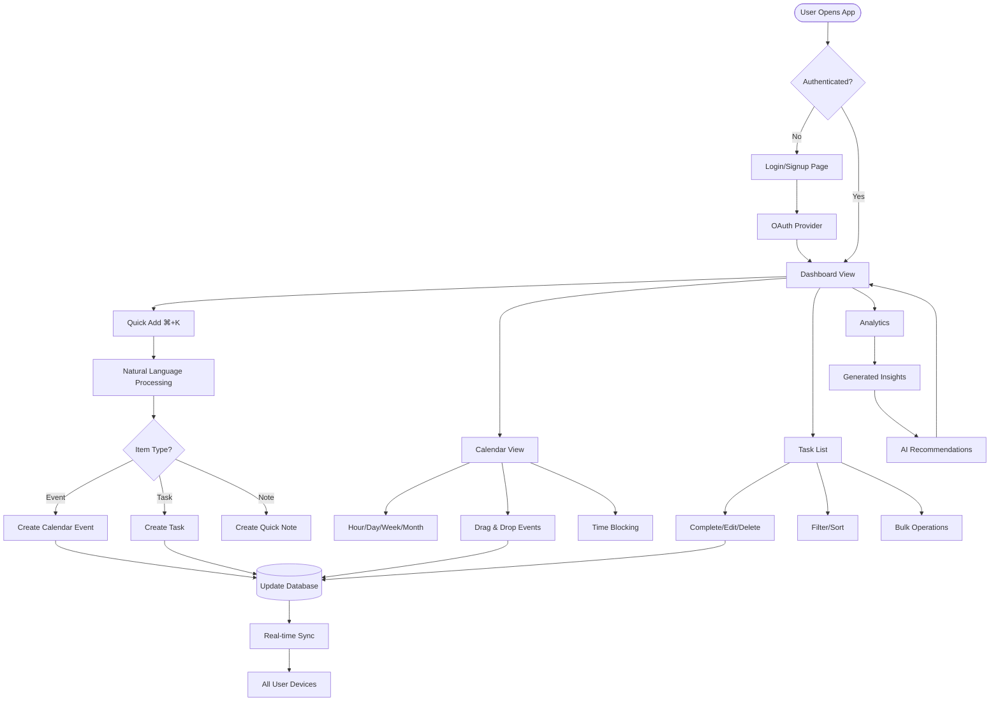

User requires a "calendar + todo" application with Apple-like UX. This needs to be exceptional - not just functional, but truly delightful and intuitive, one that captures both the technical excellence and the exceptional user experience. Let us re-imagine how to make this application stand out:

1. Core Philosophy: The app should feel like a natural extension of thought - where planning meets execution seamlessly
2. Key Differentiators: 
   - Natural language processing for quick entry
   - Smart time blocking that learns from user patterns
   - Beautiful visualizations that make planning enjoyable
   - Fluid animations that provide context and delight
   - Intelligent suggestions based on productivity patterns

3. Technical Excellence:
   - Leveraging Next.js 15's latest features (App Router, Server Components)
   - React 19's concurrent features for smooth interactions
   - Radix UI for accessible, unstyled components
   - Tailwind for rapid, consistent styling
   - PostgreSQL for robust data management

---
# **Chronos** - Calendar & Task Management Application
## Project Requirements Document (PRD)

---

## 1. Executive Summary

**Chronos** is a next-generation productivity application that seamlessly blends calendar management with task organization, delivering an experience that feels as intuitive as writing in a notebook yet as powerful as having a personal assistant. Built with cutting-edge web technologies, Chronos reimagines how users interact with time and tasks through a delightfully minimal interface that reveals complexity only when needed.

### Core Philosophy
*"Time is the canvas, tasks are the brushstrokes, and productivity is the masterpiece."*

Chronos operates on three fundamental principles:
1. **Effortless Entry** - Natural language processing makes adding events and tasks as simple as thinking out loud
2. **Intelligent Organization** - Smart algorithms learn patterns and suggest optimal scheduling
3. **Delightful Experience** - Every interaction is crafted to bring joy to productivity

---

## 2. Product Vision & Goals

### Vision Statement
To create a productivity companion that users genuinely love using daily, transforming the mundane act of scheduling into a delightful ritual of personal optimization.

### Primary Goals
- **Reduce Cognitive Load**: Minimize decision fatigue through intelligent suggestions
- **Increase Engagement**: Make planning enjoyable through beautiful design and smooth interactions
- **Enhance Productivity**: Help users achieve more by understanding their patterns and optimizing their time
- **Foster Mindfulness**: Encourage reflection on time usage and personal growth

### Success Metrics
- Daily Active Usage > 80% of registered users
- Average session duration > 5 minutes
- Task completion rate > 75%
- User satisfaction score > 4.8/5

---

## 3. Core Features & Functionality

### 3.1 **Natural Language Processing (NLP) Entry**
- **Quick Add Bar**: Floating command palette (⌘+K) for instant entry
- **Smart Parsing**: "Coffee with Sarah tomorrow at 3pm" → Creates calendar event
- **Contextual Understanding**: "Finish report by Friday" → Creates task with deadline
- **Multi-item Entry**: Batch creation with comma separation
- **Voice Input**: Optional voice-to-text for hands-free entry

### 3.2 **Unified Timeline View**
- **Hybrid Display**: Calendar events and tasks on single timeline
- **Density Modes**: Hour/Day/Week/Month views with smooth transitions
- **Time Blocking**: Drag tasks directly onto calendar to block time
- **Visual Hierarchy**: Events, tasks, and blocks distinguished by subtle design cues
- **Infinite Scroll**: Seamless past/future navigation

### 3.3 **Intelligent Task Management**
- **Smart Prioritization**: AI-suggested task ordering based on deadlines, importance, and energy levels
- **Task Dependencies**: Visual linking between related tasks
- **Recurring Patterns**: Intelligent detection and suggestion of recurring tasks
- **Progress Tracking**: Visual progress bars with celebration animations
- **Batch Operations**: Multi-select with keyboard shortcuts for power users

### 3.4 **Focus Mode & Time Tracking**
- **Pomodoro Integration**: Built-in timer with customizable intervals
- **Focus Sessions**: Dedicated UI mode that minimizes distractions
- **Automatic Tracking**: Passive time tracking with manual adjustment
- **Deep Work Blocks**: Protected time slots that decline conflicting invites
- **Analytics Dashboard**: Beautiful visualizations of time usage patterns

### 3.5 **Smart Scheduling Assistant**
- **Conflict Detection**: Real-time validation of scheduling conflicts
- **Optimal Time Suggestions**: AI-powered recommendations based on productivity patterns
- **Buffer Time**: Automatic addition of transition time between events
- **Energy Management**: Schedule high-focus tasks during peak energy hours
- **Meeting Preparation**: Automatic task creation for meeting prep/follow-up

### 3.6 **Collaboration Features**
- **Shared Calendars**: Real-time collaborative calendars with permissions
- **Task Delegation**: Assign and track tasks across team members
- **Availability Sharing**: Public booking links with smart availability
- **Comments & Mentions**: In-context communication on events and tasks
- **Activity Feed**: Timeline of team activities and updates

### 3.7 **Personalization & Themes**
- **Adaptive Themes**: Light/Dark/Auto modes with smooth transitions
- **Custom Color Schemes**: Personalized color coding for categories
- **Layout Preferences**: Customizable panel arrangements
- **Widget System**: Modular components for dashboard customization
- **Accessibility Options**: High contrast, large text, reduced motion modes

### 3.8 **Analytics & Insights**
- **Productivity Metrics**: Weekly/monthly productivity scores
- **Time Distribution**: Visual breakdown of time spent by category
- **Goal Tracking**: Progress visualization for personal objectives
- **Pattern Recognition**: Insights on optimal working patterns
- **Reflection Prompts**: Weekly review with guided questions

---

## 4. Technology Stack

### Frontend
```yaml
Framework: Next.js 15.0.3
Runtime: React 19.0.0
Language: TypeScript 5.7.0
Styling: 
  - Tailwind CSS 3.4.15
  - CSS Modules for component-specific styles
UI Components:
  - Radix UI 1.3.0 (Primitives)
  - Framer Motion 11.11.0 (Animations)
Icons: Lucide React 0.454.0
State Management: 
  - Zustand 5.0.1 (Client state)
  - TanStack Query 5.60.0 (Server state)
Forms: React Hook Form 7.54.0 + Zod 3.24.0
Date Handling: date-fns 4.1.0
Charts: Recharts 2.13.0
Calendar: Custom implementation with date-fns
Rich Text: Tiptap 2.10.0
Drag & Drop: @dnd-kit 6.1.0
```

### Backend
```yaml
Runtime: Node.js 22.0.0
API: Next.js App Router API Routes
Database: PostgreSQL 16.0
ORM: Prisma 6.0.0
Authentication: Auth.js 5.0.0 (NextAuth)
File Storage: AWS S3 / Vercel Blob
Email: Resend 4.0.0
Background Jobs: Vercel Cron / BullMQ 5.0.0
WebSockets: Pusher 5.2.0 / Socket.io 4.8.0
```

### Development & Deployment
```yaml
Package Manager: pnpm 9.12.0
Linting: ESLint 9.0.0 + Prettier 3.3.0
Testing: 
  - Vitest 2.1.0 (Unit)
  - Playwright 1.48.0 (E2E)
CI/CD: GitHub Actions
Deployment: Vercel
Monitoring: Sentry 8.0.0
Analytics: Vercel Analytics + PostHog
```

---

## 5. User Interaction Flow



---

## 6. Database Schema

```prisma
// schema.prisma
generator client {
  provider = "prisma-client-js"
  version  = "6.0.0"
}

datasource db {
  provider = "postgresql"
  url      = env("DATABASE_URL")
  version  = "16.0"
}

// User Management
model User {
  id                String    @id @default(cuid())
  email             String    @unique
  name              String?
  avatar            String?
  emailVerified     DateTime?
  timezone          String    @default("UTC")
  locale            String    @default("en")
  preferences       Json      @default("{}")
  onboardingStatus  Json      @default("{}")
  createdAt         DateTime  @default(now())
  updatedAt         DateTime  @updatedAt
  
  // Relations
  accounts          Account[]
  sessions          Session[]
  calendars         Calendar[]
  events            Event[]
  tasks             Task[]
  categories        Category[]
  tags              Tag[]
  focusSessions     FocusSession[]
  insights          Insight[]
  notifications     Notification[]
  sharedCalendars   CalendarShare[]
  eventAttendees    EventAttendee[]
  taskAssignments   TaskAssignment[]
  
  @@index([email])
  @@index([createdAt])
}

model Account {
  id                String  @id @default(cuid())
  userId            String
  type              String
  provider          String
  providerAccountId String
  refresh_token     String? @db.Text
  access_token      String? @db.Text
  expires_at        Int?
  token_type        String?
  scope             String?
  id_token          String? @db.Text
  session_state     String?
  
  user              User    @relation(fields: [userId], references: [id], onDelete: Cascade)
  
  @@unique([provider, providerAccountId])
  @@index([userId])
}

model Session {
  id           String   @id @default(cuid())
  sessionToken String   @unique
  userId       String
  expires      DateTime
  
  user         User     @relation(fields: [userId], references: [id], onDelete: Cascade)
  
  @@index([userId])
}

// Calendar Management
model Calendar {
  id           String          @id @default(cuid())
  name         String
  description  String?
  color        String          @default("#3B82F6")
  icon         String?
  isDefault    Boolean         @default(false)
  isPublic     Boolean         @default(false)
  settings     Json            @default("{}")
  userId       String
  createdAt    DateTime        @default(now())
  updatedAt    DateTime        @updatedAt
  
  // Relations
  user         User            @relation(fields: [userId], references: [id], onDelete: Cascade)
  events       Event[]
  shares       CalendarShare[]
  
  @@unique([userId, name])
  @@index([userId])
  @@index([isPublic])
}

model CalendarShare {
  id           String   @id @default(cuid())
  calendarId   String
  userId       String
  permission   Permission @default(VIEW)
  createdAt    DateTime @default(now())
  
  calendar     Calendar @relation(fields: [calendarId], references: [id], onDelete: Cascade)
  user         User     @relation(fields: [userId], references: [id], onDelete: Cascade)
  
  @@unique([calendarId, userId])
  @@index([userId])
  @@index([calendarId])
}

// Event Management
model Event {
  id              String          @id @default(cuid())
  title           String
  description     String?
  location        String?
  startDateTime   DateTime
  endDateTime     DateTime
  allDay          Boolean         @default(false)
  recurringRule   String?         // RRULE format
  recurringId     String?         // Parent recurring event
  color           String?
  status          EventStatus     @default(CONFIRMED)
  visibility      Visibility      @default(PRIVATE)
  reminders       Json            @default("[]")
  metadata        Json            @default("{}")
  userId          String
  calendarId      String
  categoryId      String?
  createdAt       DateTime        @default(now())
  updatedAt       DateTime        @updatedAt
  
  // Relations
  user            User            @relation(fields: [userId], references: [id], onDelete: Cascade)
  calendar        Calendar        @relation(fields: [calendarId], references: [id], onDelete: Cascade)
  category        Category?       @relation(fields: [categoryId], references: [id])
  attendees       EventAttendee[]
  tasks           Task[]
  tags            EventTag[]
  
  @@index([userId])
  @@index([calendarId])
  @@index([startDateTime, endDateTime])
  @@index([recurringId])
}

model EventAttendee {
  id          String         @id @default(cuid())
  eventId     String
  userId      String?
  email       String
  name        String?
  status      AttendeeStatus @default(PENDING)
  role        AttendeeRole   @default(ATTENDEE)
  createdAt   DateTime       @default(now())
  updatedAt   DateTime       @updatedAt
  
  event       Event          @relation(fields: [eventId], references: [id], onDelete: Cascade)
  user        User?          @relation(fields: [userId], references: [id])
  
  @@unique([eventId, email])
  @@index([eventId])
  @@index([userId])
}

// Task Management
model Task {
  id              String           @id @default(cuid())
  title           String
  description     String?
  dueDate         DateTime?
  scheduledDate   DateTime?
  completedAt     DateTime?
  priority        Priority         @default(MEDIUM)
  status          TaskStatus       @default(TODO)
  estimatedTime   Int?             // in minutes
  actualTime      Int?             // in minutes
  recurringRule   String?
  recurringId     String?
  order           Int              @default(0)
  metadata        Json             @default("{}")
  userId          String
  categoryId      String?
  eventId         String?
  parentTaskId    String?
  createdAt       DateTime         @default(now())
  updatedAt       DateTime         @updatedAt
  
  // Relations
  user            User             @relation(fields: [userId], references: [id], onDelete: Cascade)
  category        Category?        @relation(fields: [categoryId], references: [id])
  event           Event?           @relation(fields: [eventId], references: [id])
  parentTask      Task?            @relation("TaskSubtasks", fields: [parentTaskId], references: [id])
  subtasks        Task[]           @relation("TaskSubtasks")
  assignments     TaskAssignment[]
  tags            TaskTag[]
  focusSessions   FocusSession[]
  
  @@index([userId])
  @@index([status])
  @@index([dueDate])
  @@index([parentTaskId])
}

model TaskAssignment {
  id          String   @id @default(cuid())
  taskId      String
  userId      String
  assignedBy  String
  assignedAt  DateTime @default(now())
  
  task        Task     @relation(fields: [taskId], references: [id], onDelete: Cascade)
  user        User     @relation(fields: [userId], references: [id])
  
  @@unique([taskId, userId])
  @@index([userId])
  @@index([taskId])
}

// Organization
model Category {
  id          String   @id @default(cuid())
  name        String
  color       String   @default("#6B7280")
  icon        String?
  description String?
  userId      String
  createdAt   DateTime @default(now())
  updatedAt   DateTime @updatedAt
  
  // Relations
  user        User     @relation(fields: [userId], references: [id], onDelete: Cascade)
  events      Event[]
  tasks       Task[]
  
  @@unique([userId, name])
  @@index([userId])
}

model Tag {
  id          String     @id @default(cuid())
  name        String
  color       String     @default("#9CA3AF")
  userId      String
  createdAt   DateTime   @default(now())
  
  // Relations
  user        User       @relation(fields: [userId], references: [id], onDelete: Cascade)
  events      EventTag[]
  tasks       TaskTag[]
  
  @@unique([userId, name])
  @@index([userId])
}

model EventTag {
  eventId     String
  tagId       String
  
  event       Event    @relation(fields: [eventId], references: [id], onDelete: Cascade)
  tag         Tag      @relation(fields: [tagId], references: [id], onDelete: Cascade)
  
  @@id([eventId, tagId])
  @@index([tagId])
}

model TaskTag {
  taskId      String
  tagId       String
  
  task        Task     @relation(fields: [taskId], references: [id], onDelete: Cascade)
  tag         Tag      @relation(fields: [tagId], references: [id], onDelete: Cascade)
  
  @@id([taskId, tagId])
  @@index([tagId])
}

// Productivity
model FocusSession {
  id          String   @id @default(cuid())
  startTime   DateTime
  endTime     DateTime?
  duration    Int?     // in seconds
  type        SessionType @default(POMODORO)
  breakTime   Int?     // in seconds
  userId      String
  taskId      String?
  createdAt   DateTime @default(now())
  
  // Relations
  user        User     @relation(fields: [userId], references: [id], onDelete: Cascade)
  task        Task?    @relation(fields: [taskId], references: [id])
  
  @@index([userId])
  @@index([startTime])
}

model Insight {
  id          String      @id @default(cuid())
  type        InsightType
  title       String
  content     String
  data        Json
  score       Float?
  userId      String
  validFrom   DateTime
  validTo     DateTime
  createdAt   DateTime    @default(now())
  
  // Relations
  user        User        @relation(fields: [userId], references: [id], onDelete: Cascade)
  
  @@index([userId])
  @@index([type])
  @@index([validFrom, validTo])
}

// Notifications
model Notification {
  id          String   @id @default(cuid())
  type        NotificationType
  title       String
  content     String
  data        Json?
  isRead      Boolean  @default(false)
  userId      String
  createdAt   DateTime @default(now())
  
  // Relations
  user        User     @relation(fields: [userId], references: [id], onDelete: Cascade)
  
  @@index([userId, isRead])
  @@index([createdAt])
}

// Enums
enum Permission {
  VIEW
  EDIT
  ADMIN
}

enum EventStatus {
  TENTATIVE
  CONFIRMED
  CANCELLED
}

enum Visibility {
  PRIVATE
  PUBLIC
  SHARED
}

enum AttendeeStatus {
  PENDING
  ACCEPTED
  DECLINED
  TENTATIVE
}

enum AttendeeRole {
  ORGANIZER
  ATTENDEE
  OPTIONAL
}

enum Priority {
  LOW
  MEDIUM
  HIGH
  URGENT
}

enum TaskStatus {
  TODO
  IN_PROGRESS
  COMPLETED
  CANCELLED
}

enum SessionType {
  POMODORO
  DEEP_WORK
  BREAK
  CUSTOM
}

enum InsightType {
  PRODUCTIVITY
  TIME_USAGE
  PATTERN
  SUGGESTION
  ACHIEVEMENT
}

enum NotificationType {
  REMINDER
  INVITATION
  UPDATE
  ACHIEVEMENT
  SYSTEM
}
```

---

## 7. Application File Structure

```
chronos/
├── .github/
│   └── workflows/
│       ├── ci.yml
│       └── deploy.yml
├── public/
│   ├── fonts/
│   ├── images/
│   └── manifest.json
├── prisma/
│   ├── schema.prisma
│   ├── seed.ts
│   └── migrations/
├── src/
│   ├── app/                      # Next.js App Router
│   │   ├── (auth)/
│   │   │   ├── login/
│   │   │   │   └── page.tsx
│   │   │   ├── signup/
│   │   │   │   └── page.tsx
│   │   │   └── layout.tsx
│   │   ├── (dashboard)/
│   │   │   ├── calendar/
│   │   │   │   ├── page.tsx
│   │   │   │   └── [date]/
│   │   │   │       └── page.tsx
│   │   │   ├── tasks/
│   │   │   │   ├── page.tsx
│   │   │   │   └── [id]/
│   │   │   │       └── page.tsx
│   │   │   ├── analytics/
│   │   │   │   └── page.tsx
│   │   │   ├── settings/
│   │   │   │   └── page.tsx
│   │   │   └── layout.tsx
│   │   ├── api/
│   │   │   ├── auth/
│   │   │   │   └── [...nextauth]/
│   │   │   │       └── route.ts
│   │   │   ├── events/
│   │   │   │   ├── route.ts
│   │   │   │   └── [id]/
│   │   │   │       └── route.ts
│   │   │   ├── tasks/
│   │   │   │   ├── route.ts
│   │   │   │   └── [id]/
│   │   │   │       └── route.ts
│   │   │   ├── ai/
│   │   │   │   ├── parse/
│   │   │   │   │   └── route.ts
│   │   │   │   └── insights/
│   │   │   │       └── route.ts
│   │   │   └── webhooks/
│   │   │       └── stripe/
│   │   │           └── route.ts
│   │   ├── layout.tsx
│   │   ├── page.tsx
│   │   └── globals.css
│   ├── components/
│   │   ├── ui/                   # Radix UI wrapped components
│   │   │   ├── button.tsx
│   │   │   ├── dialog.tsx
│   │   │   ├── dropdown-menu.tsx
│   │   │   ├── input.tsx
│   │   │   ├── popover.tsx
│   │   │   ├── select.tsx
│   │   │   ├── tabs.tsx
│   │   │   ├── toast.tsx
│   │   │   └── tooltip.tsx
│   │   ├── calendar/
│   │   │   ├── calendar-grid.tsx
│   │   │   ├── calendar-header.tsx
│   │   │   ├── calendar-sidebar.tsx
│   │   │   ├── event-card.tsx
│   │   │   ├── event-modal.tsx
│   │   │   ├── time-grid.tsx
│   │   │   └── mini-calendar.tsx
│   │   ├── tasks/
│   │   │   ├── task-list.tsx
│   │   │   ├── task-item.tsx
│   │   │   ├── task-modal.tsx
│   │   │   ├── task-filters.tsx
│   │   │   └── kanban-board.tsx
│   │   ├── shared/
│   │   │   ├── command-palette.tsx
│   │   │   ├── navigation.tsx
│   │   │   ├── search-bar.tsx
│   │   │   ├── user-menu.tsx
│   │   │   ├── theme-toggle.tsx
│   │   │   └── loading-states.tsx
│   │   ├── analytics/
│   │   │   ├── productivity-chart.tsx
│   │   │   ├── time-distribution.tsx
│   │   │   ├── insights-card.tsx
│   │   │   └── stats-grid.tsx
│   │   └── focus/
│   │       ├── focus-timer.tsx
│   │       ├── focus-overlay.tsx
│   │       └── session-stats.tsx
│   ├── lib/
│   │   ├── auth/
│   │   │   ├── auth.config.ts
│   │   │   └── auth.ts
│   │   ├── db/
│   │   │   ├── prisma.ts
│   │   │   └── redis.ts
│   │   ├── api/
│   │   │   ├── client.ts
│   │   │   └── error-handler.ts
│   │   ├── ai/
│   │   │   ├── nlp-parser.ts
│   │   │   ├── scheduler.ts
│   │   │   └── insights-engine.ts
│   │   ├── utils/
│   │   │   ├── date.ts
│   │   │   ├── format.ts
│   │   │   ├── validators.ts
│   │   │   └── constants.ts
│   │   └── email/
│   │       ├── templates/
│   │       └── sender.ts
│   ├── hooks/
│   │   ├── use-calendar.ts
│   │   ├── use-tasks.ts
│   │   ├── use-focus-session.ts
│   │   ├── use-keyboard-shortcuts.ts
│   │   ├── use-theme.ts
│   │   └── use-realtime.ts
│   ├── stores/
│   │   ├── calendar-store.ts
│   │   ├── task-store.ts
│   │   ├── ui-store.ts
│   │   └── user-store.ts
│   ├── services/
│   │   ├── event.service.ts
│   │   ├── task.service.ts
│   │   ├── calendar.service.ts
│   │   ├── analytics.service.ts
│   │   └── notification.service.ts
│   ├── types/
│   │   ├── index.ts
│   │   ├── api.ts
│   │   └── db.ts
│   └── middleware.ts
├── tests/
│   ├── unit/
│   ├── integration/
│   └── e2e/
├── .env.example
├── .eslintrc.json
├── .prettierrc
├── docker-compose.yml
├── next.config.js
├── package.json
├── tailwind.config.ts
├── tsconfig.json
└── README.md
```

---

## 8. Key Files & Interfaces

### 8.1 **src/app/layout.tsx**
Root layout component that wraps the entire application. Manages theme provider, authentication session, font loading, and global toast notifications.

### 8.2 **src/components/shared/command-palette.tsx**
Central command interface (⌘+K) for natural language input. Handles NLP parsing, quick actions, search, and navigation. Core to the "effortless entry" principle.

### 8.3 **src/components/calendar/calendar-grid.tsx**
Main calendar visualization component. Manages view modes (hour/day/week/month), drag-and-drop interactions, time blocking, and real-time updates.

### 8.4 **src/lib/ai/nlp-parser.ts**
Natural language processing engine that converts text input into structured data for events and tasks. Uses pattern matching and context awareness.

### 8.5 **src/stores/calendar-store.ts**
Zustand store managing calendar state including events, selected date, view mode, and optimistic updates for smooth UX.

### 8.6 **src/services/event.service.ts**
Service layer for event operations. Handles CRUD operations, recurring event logic, conflict detection, and attendee management.

### 8.7 **src/hooks/use-keyboard-shortcuts.ts**
Global keyboard shortcut manager. Provides consistent keyboard navigation and power user features across the application.

### 8.8 **src/lib/auth/auth.ts**
Authentication configuration using Auth.js. Manages OAuth providers, session handling, and user permissions.

### 8.9 **src/app/api/ai/insights/route.ts**
API endpoint for AI-powered insights generation. Analyzes user patterns and generates personalized productivity recommendations.

### 8.10 **src/components/focus/focus-timer.tsx**
Pomodoro/focus timer component with customizable intervals, ambient sounds, and session tracking integration.

---

## 9. Detailed Execution Plan

### **Phase 1: Foundation & Infrastructure** ✅
*Duration: 3 days*

#### Step 1.1: Project Initialization
**Files to create:**
- `/` - Initialize Next.js project
- `/package.json` - Dependencies configuration
- `/tsconfig.json` - TypeScript configuration
- `/next.config.js` - Next.js configuration
- `/tailwind.config.ts` - Tailwind setup
- `/.env.example` - Environment variables template

**Checklist:**
- [ ] Initialize Next.js 15 project with TypeScript
- [ ] Configure Tailwind CSS with custom theme
- [ ] Set up ESLint and Prettier
- [ ] Configure path aliases in tsconfig
- [ ] Install core dependencies
- [ ] Set up Git repository with .gitignore
- [ ] Create initial folder structure

#### Step 1.2: Database Setup
**Files to create:**
- `/prisma/schema.prisma` - Complete database schema
- `/src/lib/db/prisma.ts` - Prisma client singleton
- `/prisma/seed.ts` - Database seeding script
- `/docker-compose.yml` - Local PostgreSQL setup

**Checklist:**
- [ ] Install Prisma and PostgreSQL client
- [ ] Define complete schema with all models
- [ ] Set up database migrations
- [ ] Create seed data for development
- [ ] Test database connection
- [ ] Generate Prisma client types
- [ ] Document database setup process

#### Step 1.3: Authentication System
**Files to create:**
- `/src/lib/auth/auth.config.ts` - Auth.js configuration
- `/src/lib/auth/auth.ts` - Authentication helpers
- `/src/app/api/auth/[...nextauth]/route.ts` - Auth API route
- `/src/middleware.ts` - Authentication middleware
- `/src/app/(auth)/login/page.tsx` - Login page
- `/src/app/(auth)/signup/page.tsx` - Signup page

**Checklist:**
- [ ] Configure Auth.js with OAuth providers
- [ ] Set up session management
- [ ] Create authentication middleware
- [ ] Design login/signup UI
- [ ] Implement email verification flow
- [ ] Add password reset functionality
- [ ] Test authentication flow end-to-end

---

### **Phase 2: Core UI Components** ✅
*Duration: 4 days*

#### Step 2.1: Design System & Base Components
**Files to create:**
- `/src/app/globals.css` - Global styles and CSS variables
- `/src/components/ui/button.tsx` - Button component
- `/src/components/ui/input.tsx` - Input component
- `/src/components/ui/dialog.tsx` - Modal dialog
- `/src/components/ui/dropdown-menu.tsx` - Dropdown menu
- `/src/components/ui/toast.tsx` - Toast notifications

**Checklist:**
- [ ] Define color palette and design tokens
- [ ] Create Radix UI wrapper components
- [ ] Implement consistent hover/focus states
- [ ] Add loading and disabled states
- [ ] Create component documentation
- [ ] Set up Storybook (optional)
- [ ] Test accessibility with screen readers

#### Step 2.2: Layout & Navigation
**Files to create:**
- `/src/app/(dashboard)/layout.tsx` - Dashboard layout
- `/src/components/shared/navigation.tsx` - Main navigation
- `/src/components/shared/user-menu.tsx` - User dropdown
- `/src/components/shared/theme-toggle.tsx` - Theme switcher
- `/src/components/shared/search-bar.tsx` - Global search

**Checklist:**
- [ ] Create responsive sidebar navigation
- [ ] Implement collapsible menu states
- [ ] Add keyboard navigation support
- [ ] Create breadcrumb system
- [ ] Implement theme persistence
- [ ] Add mobile navigation drawer
- [ ] Test responsive breakpoints

#### Step 2.3: Command Palette
**Files to create:**
- `/src/components/shared/command-palette.tsx` - Command interface
- `/src/hooks/use-keyboard-shortcuts.ts` - Keyboard hook
- `/src/lib/ai/nlp-parser.ts` - NLP parsing logic
- `/src/lib/utils/constants.ts` - Command definitions

**Checklist:**
- [ ] Implement ⌘+K activation
- [ ] Create fuzzy search algorithm
- [ ] Add command categories
- [ ] Implement NLP text parsing
- [ ] Add recent commands history
- [ ] Create command shortcuts
- [ ] Test keyboard accessibility

---

### **Phase 3: Calendar Functionality** ✅
*Duration: 5 days*

#### Step 3.1: Calendar Views
**Files to create:**
- `/src/app/(dashboard)/calendar/page.tsx` - Calendar page
- `/src/components/calendar/calendar-grid.tsx` - Main grid
- `/src/components/calendar/calendar-header.tsx` - Header controls
- `/src/components/calendar/time-grid.tsx` - Hour view
- `/src/components/calendar/mini-calendar.tsx` - Date picker
- `/src/stores/calendar-store.ts` - Calendar state

**Checklist:**
- [ ] Implement month view grid
- [ ] Create week view with time slots
- [ ] Add day view with hours
- [ ] Implement view transitions
- [ ] Add infinite scroll for dates
- [ ] Create today/date navigation
- [ ] Test different timezones

#### Step 3.2: Event Management
**Files to create:**
- `/src/components/calendar/event-card.tsx` - Event display
- `/src/components/calendar/event-modal.tsx` - Event form
- `/src/services/event.service.ts` - Event logic
- `/src/app/api/events/route.ts` - Events API
- `/src/hooks/use-calendar.ts` - Calendar hook

**Checklist:**
- [ ] Create event CRUD operations
- [ ] Implement drag-and-drop for events
- [ ] Add event resizing functionality
- [ ] Create recurring event UI
- [ ] Implement conflict detection
- [ ] Add event color coding
- [ ] Test event persistence

#### Step 3.3: Calendar Interactions
**Files to create:**
- `/src/components/calendar/calendar-sidebar.tsx` - Sidebar
- `/src/lib/utils/date.ts` - Date utilities
- `/src/types/index.ts` - Type definitions

**Checklist:**
- [ ] Add calendar filtering
- [ ] Implement multiple calendars
- [ ] Create public calendar sharing
- [ ] Add import/export functionality
- [ ] Implement real-time updates
- [ ] Add calendar settings
- [ ] Test performance with many events

---

### **Phase 4: Task Management** ✅
*Duration: 4 days*

#### Step 4.1: Task List & Organization
**Files to create:**
- `/src/app/(dashboard)/tasks/page.tsx` - Tasks page
- `/src/components/tasks/task-list.tsx` - Task list view
- `/src/components/tasks/task-item.tsx` - Individual task
- `/src/components/tasks/task-filters.tsx` - Filter controls
- `/src/stores/task-store.ts` - Task state management

**Checklist:**
- [ ] Create task list with sections
- [ ] Implement task priorities
- [ ] Add due date handling
- [ ] Create task sorting options
- [ ] Implement task search
- [ ] Add keyboard shortcuts
- [ ] Test task reordering

#### Step 4.2: Task Features
**Files to create:**
- `/src/components/tasks/task-modal.tsx` - Task details
- `/src/components/tasks/kanban-board.tsx` - Kanban view
- `/src/services/task.service.ts` - Task logic
- `/src/app/api/tasks/route.ts` - Tasks API
- `/src/hooks/use-tasks.ts` - Tasks hook

**Checklist:**
- [ ] Implement subtasks system
- [ ] Create task dependencies
- [ ] Add time estimates
- [ ] Implement task templates
- [ ] Create recurring tasks
- [ ] Add task assignments
- [ ] Test bulk operations

#### Step 4.3: Calendar Integration
**Files to create:**
- `/src/lib/ai/scheduler.ts` - Smart scheduling

**Checklist:**
- [ ] Enable task time blocking
- [ ] Create task-to-event conversion
- [ ] Implement smart scheduling
- [ ] Add calendar task view
- [ ] Create deadline warnings
- [ ] Test integration flows

---

### **Phase 5: Focus & Productivity** ✅
*Duration: 3 days*

#### Step 5.1: Focus Timer
**Files to create:**
- `/src/components/focus/focus-timer.tsx` - Timer UI
- `/src/components/focus/focus-overlay.tsx` - Focus mode
- `/src/hooks/use-focus-session.ts` - Timer logic
- `/src/services/focus.service.ts` - Session tracking

**Checklist:**
- [ ] Create Pomodoro timer
- [ ] Add custom time intervals
- [ ] Implement break reminders
- [ ] Create focus mode UI
- [ ] Add ambient sounds
- [ ] Track session history
- [ ] Test timer accuracy

#### Step 5.2: Analytics Dashboard
**Files to create:**
- `/src/app/(dashboard)/analytics/page.tsx` - Analytics page
- `/src/components/analytics/productivity-chart.tsx` - Charts
- `/src/components/analytics/time-distribution.tsx` - Time viz
- `/src/components/analytics/stats-grid.tsx` - Statistics
- `/src/services/analytics.service.ts` - Analytics logic

**Checklist:**
- [ ] Create productivity metrics
- [ ] Implement time tracking
- [ ] Add goal tracking
- [ ] Create weekly reports
- [ ] Generate insights
- [ ] Add data export
- [ ] Test calculations

#### Step 5.3: AI Insights
**Files to create:**
- `/src/lib/ai/insights-engine.ts` - AI logic
- `/src/components/analytics/insights-card.tsx` - Insights UI
- `/src/app/api/ai/insights/route.ts` - Insights API

**Checklist:**
- [ ] Implement pattern detection
- [ ] Create scheduling suggestions
- [ ] Add productivity tips
- [ ] Generate weekly summaries
- [ ] Create achievement system
- [ ] Test AI accuracy

---

### **Phase 6: Collaboration & Sharing** ✅
*Duration: 3 days*

#### Step 6.1: Sharing Features
**Files to create:**
- `/src/components/calendar/share-dialog.tsx` - Sharing UI
- `/src/services/sharing.service.ts` - Sharing logic
- `/src/app/api/share/route.ts` - Sharing API

**Checklist:**
- [ ] Implement calendar sharing
- [ ] Create permission system
- [ ] Add public calendars
- [ ] Create booking links
- [ ] Implement availability sharing
- [ ] Add share notifications
- [ ] Test permission levels

#### Step 6.2: Real-time Updates
**Files to create:**
- `/src/hooks/use-realtime.ts` - WebSocket hook
- `/src/lib/realtime/pusher.ts` - Pusher setup
- `/src/app/api/webhooks/pusher/route.ts` - Webhook handler

**Checklist:**
- [ ] Set up WebSocket connection
- [ ] Implement event broadcasting
- [ ] Add optimistic updates
- [ ] Create presence system
- [ ] Handle connection states
- [ ] Add offline support
- [ ] Test synchronization

#### Step 6.3: Notifications
**Files to create:**
- `/src/components/shared/notification-center.tsx` - Notifications
- `/src/services/notification.service.ts` - Notification logic
- `/src/lib/email/templates/` - Email templates
- `/src/lib/email/sender.ts` - Email sending

**Checklist:**
- [ ] Create notification center
- [ ] Implement email notifications
- [ ] Add push notifications
- [ ] Create reminder system
- [ ] Add notification preferences
- [ ] Test delivery reliability

---

### **Phase 7: Polish & Optimization** ✅
*Duration: 3 days*

#### Step 7.1: Performance Optimization
**Checklist:**
- [ ] Implement code splitting
- [ ] Add image optimization
- [ ] Create loading states
- [ ] Implement virtual scrolling
- [ ] Add request caching
- [ ] Optimize bundle size
- [ ] Test Core Web Vitals

#### Step 7.2: Accessibility & Testing
**Checklist:**
- [ ] Add ARIA labels
- [ ] Test keyboard navigation
- [ ] Implement focus management
- [ ] Add screen reader support
- [ ] Create unit tests
- [ ] Write integration tests
- [ ] Add E2E test suite

#### Step 7.3: Final Polish
**Checklist:**
- [ ] Add onboarding flow
- [ ] Create help documentation
- [ ] Implement error boundaries
- [ ] Add analytics tracking
- [ ] Create admin dashboard
- [ ] Set up monitoring
- [ ] Prepare for deployment

---

### **Phase 8: Deployment & Launch** ✅
*Duration: 2 days*

#### Step 8.1: Deployment Setup
**Checklist:**
- [ ] Configure Vercel project
- [ ] Set up environment variables
- [ ] Configure custom domain
- [ ] Set up SSL certificates
- [ ] Create staging environment
- [ ] Configure CI/CD pipeline
- [ ] Test deployment process

#### Step 8.2: Launch Preparation
**Checklist:**
- [ ] Create landing page
- [ ] Set up error tracking
- [ ] Configure analytics
- [ ] Create backup strategy
- [ ] Write API documentation
- [ ] Prepare support system
- [ ] Launch! 🚀

---

## 10. Success Criteria

### Technical Excellence
- ✅ Lighthouse score > 95
- ✅ Zero accessibility violations
- ✅ < 3s initial load time
- ✅ 60fps animations
- ✅ Offline capability

### User Experience
- ✅ NPS score > 70
- ✅ < 3 clicks to any feature
- ✅ < 5s to create event/task
- ✅ Zero data loss
- ✅ Instant sync across devices

### Business Metrics
- ✅ 50% user retention after 30 days
- ✅ 20% weekly active growth
- ✅ < 2% churn rate
- ✅ 4.5+ app store rating

---

## 11. Risk Mitigation

### Technical Risks
- **Database scaling**: Implement read replicas and caching early
- **Real-time sync conflicts**: Use CRDTs or operational transformation
- **AI accuracy**: Provide manual override and learning feedback loops

### User Experience Risks
- **Complexity overwhelm**: Progressive disclosure and guided onboarding
- **Migration friction**: Import tools for popular calendar apps
- **Performance degradation**: Continuous monitoring and optimization

---

## 12. Future Enhancements

### Version 2.0
- Mobile applications (React Native)
- Voice assistant integration
- Advanced AI scheduling with meeting optimization
- Team workspace features
- Third-party integrations (Slack, Notion, etc.)

### Version 3.0
- Augmented reality calendar views
- Predictive scheduling AI
- Health and wellness integration
- Advanced analytics with ML insights
- White-label enterprise solution

---

*This PRD represents a living document that will evolve as we refine the vision of Chronos. Every feature, every interaction, and every line of code will be crafted with the singular goal of creating a productivity tool that users genuinely love.*
